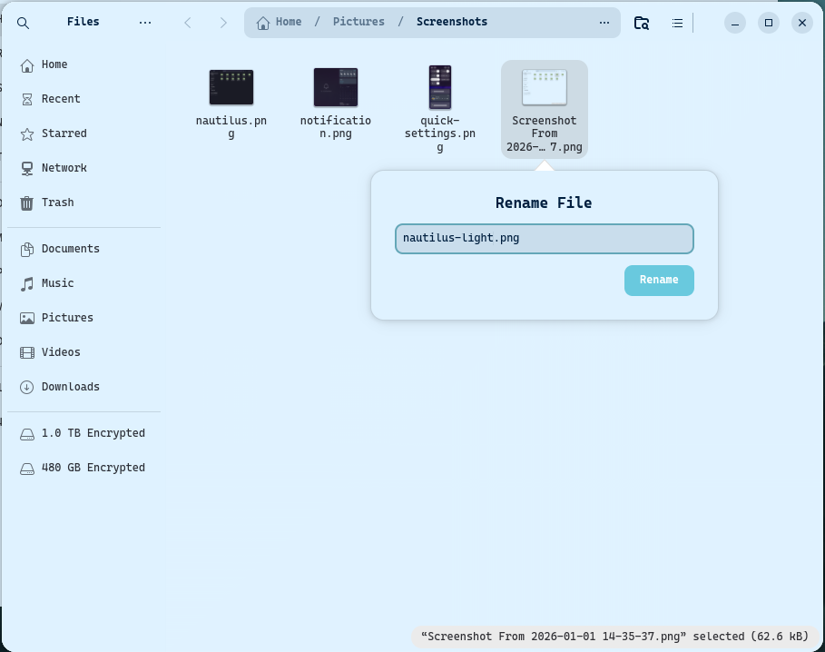
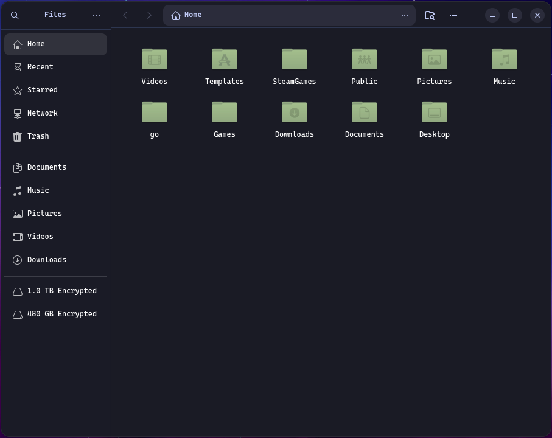
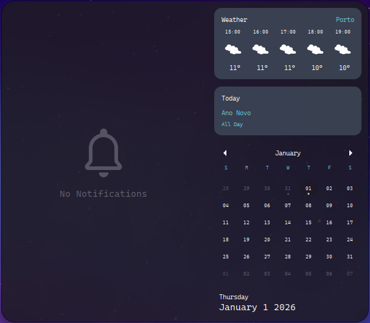
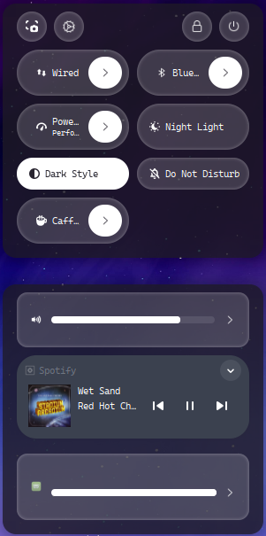

# Stylish Nord Navy

#### Arch linux theme

A dark theme for GTK based on the Nord color palette with navy blue/purple accents for dark mode and light blue color pallet for light mode.

## Installation

1. Clone the repository or download the zip file and extract it.

2. Move the extracted folder to your themes directory:

   - For a single user: `~/.themes/`
   - For all users: `/usr/share/themes/` (requires root permissions)

3. Apply the theme using your desktop environment's appearance settings or a tool like `gnome-tweaks`.

Is also recommended to copy the content in the `gtk.css` file to the end of the `gtk.css` file located on the path `~/.config/gtk-3.0/` and `~/.config/gtk-4.0/` to ensure compatibility with applications that override theme settings.

## Requirements

- GTK 3.20 or higher
- A compatible desktop environment (e.g., GNOME, XFCE, Cinnamon)
- Optional: `gnome-tweaks` for easier theme management

## Customization

You can customize the theme by modifying the CSS files located in the theme folder. Look for files like `gtk.css`, `gnome-shell.css`, and `settings.ini` to change colors, fonts, and other visual elements.

## Credits

- Based on the Nord color palette by [Arctic Ice Studio](https://www.nordtheme.com/)
- Created by [Lucas Costa](https://github.com/lucaspinacosta)

## Screenshots

